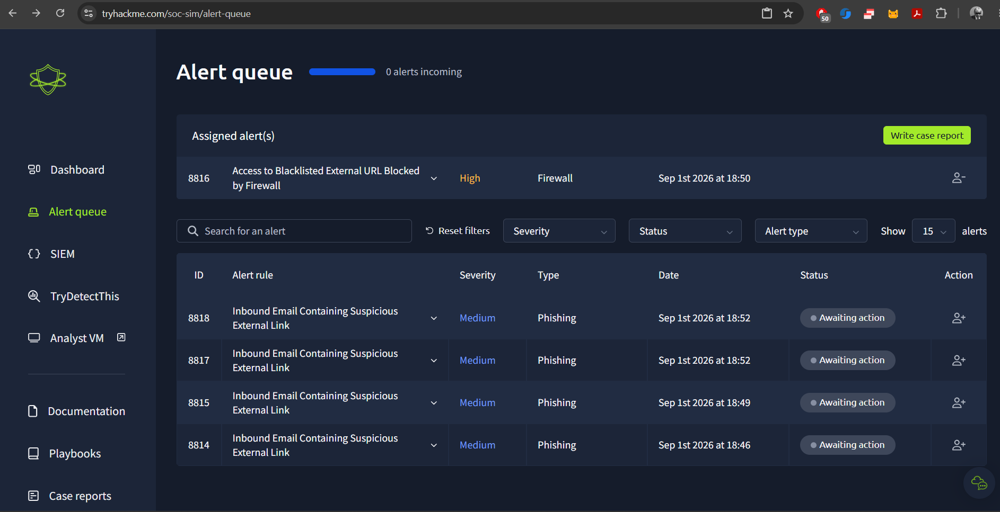

# SEIM

## **`SOC Simulation (TryHackMe)`**

Practiced triaging security alerts in a simulated SOC environment — classifying alerts as true/false positives, assigning them for handling, and documenting findings in case reports for L2 escalation.

I assigned these alerts as **True Positive**, since they involved phishing tactics using a malicious URL.

The alert severity was **High** on the dashboard, so it was important to prioritize this alert as it appeared to be a real attack. As an L1 SOC analyst, the first step was to check the URL using an analysis tool, referencing the MITRE ATT&CK framework for context.

After assigning the alert to myself, I analyzed it and wrote a case report explaining the alert triage details for the L2 analyst to continue further investigation.

I used the SIEM tool (Kibana Discover) to investigate in depth. In this screenshot, I investigated the repeated IP address and the repeated requests sent by the attacker. In this scenario, I looked at the malicious source IP that was blocked by the firewall due to the rules set in place.

- **Log 1 (blocked, port 80):** a `bit.ly` shortened link → this is what triggered the block, since shortened/obfuscated URLs are commonly used to hide phishing destinations, and it was likely already listed in threat intel/blacklist feeds.
- **Log 2 (allowed, port 443):** a direct `google.com` search query about payroll systems → clean, legitimate traffic, unrelated to the blocked request.

The same internal source IP generated two separate requests. One was a shortened `bit.ly` link on port 80, which the firewall blocked as it matched a known-malicious/blacklisted URL. The other was a legitimate Google search on port 443, related to payroll system research, which was correctly allowed. This shows the value of correlating multiple log entries from the same host to distinguish malicious activity from normal user behavior.

That's why I'm doing a deeper investigation in the Elastic Stack (SIEM), because sometimes I need to look at the attacker's tactics, or check whether an employee accessed a fake attacker link while browsing what appeared to be a normal URL. Sometimes attackers leave a trap on a duplicate website — the employee believes it's the real site, but in the backend they get redirected to the attacker's webpage. That's why the firewall blocked the malicious URL on port 80, while port 443 was allowed as normal traffic, depending on the rule set in each case.

Escalation Report – Alert ID: 8816

After completing the investigation, I closed the alert as SOC Analyst L1.

From all of this, what I learned is how to investigate logs, how to assign an alert to myself, and how to write a case report for L2 for further investigation. I also learned how to check whether an alert is a real alarm or a false alarm, and determine if it's a false positive or true positive. I investigated this using Discover in Kibana (Elastic Stack) for log analysis, and after the investigation, I found it to be a true positive and closed the alert accordingly, as shown in the screenshots above. All of this — including the Elastic Stack — was provided by the TryHackMe platform, where I got hands-on practice for the SOC Analyst L1 role.